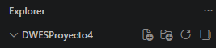
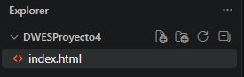
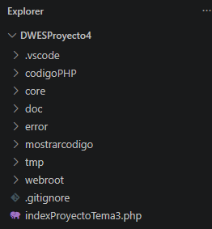
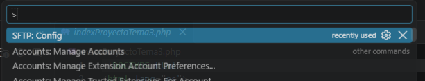

# W10ED - Cliente de desarrollo - Visual Studio Code

# Índice de Contenidos
- [W10ED - Cliente de desarrollo - Visual Studio Code](#w10ed---cliente-de-desarrollo---visual-studio-code)
- [Índice de Contenidos](#índice-de-contenidos)
      - [Datos adicionales](#datos-adicionales)
  - [Fase 0. Instalación de extensiones](#fase-0-instalación-de-extensiones)
  - [Fase 1. Creación del proyecto](#fase-1-creación-del-proyecto)
    - [Creamos la carpeta en la que vamos a guardar nuestro proyecto inicialmente.](#creamos-la-carpeta-en-la-que-vamos-a-guardar-nuestro-proyecto-inicialmente)
    - [Creamos estructura básica para trabajar](#creamos-estructura-básica-para-trabajar)
    - [Vamos a meter en este proyecto los archivos del Tema 3](#vamos-a-meter-en-este-proyecto-los-archivos-del-tema-3)
  - [Fase 2. Enlace SFTP con el servidor](#fase-2-enlace-sftp-con-el-servidor)

#### Datos adicionales
Estamos utilizando Windows 10 como sistema operativo cliente, guardando los proyectos en:

D:\Datos\Proyectos\

Utilizando Google Chrome como navegador de pruebas y uso.

---

> [!NOTE]
> En este caso vamos a utilizar Visual Studio Code como IDE, explicare tanto la creación como, configuración, conexion SFTP, conexión Github y borrado del proyecto desde Visual Studio Code.

## Fase 0. Instalación de extensiones

En la parte izquierda en el icono  o pulsando la combinacion de teclas (Crtl+Shift+X) abrimos la ventana de extensiones, buscaremos instalar esta lista:

* **SFTP**
  
La utilizamos para conectar con el servidor remoto
* **Live Server** 

Utilizada para hacer pruebas de **HTML,CSS,JavaScript** desde el cliente
* **Path Intellisense** _(Opcional)_ **Recomendado**

Nos autocompleta las direcciones de los archivos incluyendo el repositorio y el servidor
* **PHP**

Nos da soporte para programar en **PHP**
* **HTML CSS Support**

Nos da soporte para programar en **HTML,CSS**
* **HTML/CSS/JavaScript Snippets** _(Opcional)_ **Recomendado**

Nos ayuda con el desarrollo recomendando funciones,etiquetas para cada momento
* **Auto Rename Tags** _(Opcional)_ **Recomendado**

Nos cierra automaticamente las etiquetas en **HTML** y si cambiamos alguna desde el principio, nos la cambia al final tambien.
* **Remote - SSH** _(Opcional)_ **Recomendado**

Para evitar tener que conectarnos desde el terminal al servidor, esta extensión nos permite conectarnos mediante **SSH** al servidor y ver sus archivos.

Le daremos click a instalar y si nos pide algun tipo de confirmación, aceptaremos **Trust Publishers** y siguiente.


## Fase 1. Creación del proyecto

### Creamos la carpeta en la que vamos a guardar nuestro proyecto inicialmente.


Arriba a la izquierda pulsamos:

- File\Open Folder
  
Y cuando nos de a elegir una carpeta, seleccionamos la carpeta nueva de nuestro proyecto, o simplemente la creamos y la utilizamos.

Nos tiene que quedar algo asi:



### Creamos estructura básica para trabajar

Un archivo nuevo que se llame **index.html** pulsando en el icono del archivo New File...



Colocaremos una estructura básica de html:

```html
<!DOCTYPE html>
<html lang="en">
<head>
    <meta charset="UTF-8">
    <meta name="viewport" content="width=device-width, initial-scale=1.0">
    <title>Document</title>
</head>
<body>
    
</body>
</html>
```

---

### Vamos a meter en este proyecto los archivos del Tema 3

Movemos todos los archivos del tema 3 dentro del proyecto, sin cambiar nada


## Fase 2. Enlace SFTP con el servidor

Utilizando la extention **SFTP** vamos a conectarnos al servidor, pulsamos **F1** y abrimos la paleta de comandos. Pulsamos en **SFTP: Config**.


Se nos abrira un **JSON** con información sobre la configuracion SFTP. Colocaremos la siguiente configuración:

```json
{
    "name": "My Server",
    "host": "10.199.8.97", # Aqui ponemos la ip de nuestra máquina
    "protocol": "sftp",
    "port": 22,
    "username": "operadorweb", # El usuario configurado
    "password": "paso", # Su contraseña
    "remotePath": "/var/www/html/DWESProyecto4/", # El directorio que queremos usar
    "uploadOnSave": true, # Con esto pasa los archivos cada vez que guarda
    "useTempFile": false,
    "openSsh": false,
    "ignore": [
        "**/.git/**",
        "**/.vscode/**",
        "**/node_modules/**"
    ]
}
```

Una vez conectado todo, deberíamos 